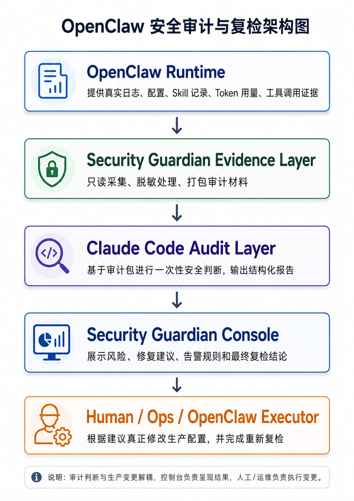

# 第 20 节课程 Framework：企业级数字员工安全自审计架构

## 1. 设计目标

本节课要设计的不是“攻击靶场”，也不是“自动修复器”，而是一套企业级数字员工上线前的安全自审计框架。

核心问题是：

> 当 OpenClaw 已经部署在云服务器上，并且具备读文件、跑工具、调用 Skill、访问业务数据的能力时，它如何调用 Claude Code 对自己做一次可信的安全体检？

因此课程关注三件事：

- OpenClaw 应该提供哪些真实证据
- Claude Code 应该审查哪些安全面
- Security Guardian 如何把审计结论转成告警建议、治理建议和上线前判断

## 2. 架构分层

<p align="center">
  
</p>

这套架构刻意把“检测”和“治理”分开：

- 检测可以自动化
- 建议可以自动生成
- 生产配置变更必须有明确责任主体和复核证据

## 3. 双方分工

### OpenClaw 需要提供什么

OpenClaw 不是直接把服务器权限交给 Claude Code，而是提供一个受控审计包。

审计包应包含：

| 类型 | 示例 |
|---|---|
| 运行日志 | 控制面访问日志、工具调用日志、Skill 执行日志 |
| 配置快照 | WebSocket/API 监听地址、鉴权配置、Origin 校验、审计日志配置 |
| Skill 记录 | Skill 来源、签名状态、权限声明、文件访问、网络出站 |
| 凭证线索 | 脱敏后的 Token/API Key 命中记录 |
| Token 用量 | 单任务消耗、每日消耗、异常暴涨记录 |
| 治理配置 | denyList、Token budget、审批策略、审计开关 |

OpenClaw 不应提供：

- 真实 SSH 私钥明文
- 真实 API Key / Token 明文
- 客户原始敏感数据
- 可让 Claude Code 直接修改生产环境的权限

### Claude Code 需要返回什么

Claude Code 的输出必须结构化，方便页面展示和后续工单化。

每个风险项至少包含：

| 字段 | 含义 |
|---|---|
| `id` | 风险编号，例如 `CC-001` |
| `severity` | `critical` / `high` / `medium` / `low` |
| `location` | 风险所在文件、配置项或日志来源 |
| `evidence` | 脱敏后的证据 |
| `risk` | 影响说明 |
| `recommendation` | 建议动作 |

Claude Code 不负责直接修复。它负责回答：

- 哪些证据说明有风险
- 风险影响是什么
- 应优先处理什么
- 哪些问题会阻断上线

## 4. 安全检查面

### 4.1 控制面安全

检查重点：

- WebSocket / API 是否监听在公网地址
- 是否缺少强鉴权
- 是否缺少 Origin 校验
- 是否允许远程关闭安全策略
- 会话有效期是否过长

典型风险：

```text
控制面暴露 + 弱鉴权 = 远程接管数字员工
```

输出建议：

- 控制面收敛到内网、VPN 或反向代理后方
- 启用强鉴权和 Origin 校验
- 禁止远程关闭安全策略
- 缩短 session TTL

### 4.2 Skill 供应链安全

检查重点：

- Skill 是否来自社区或未知来源
- 是否缺少签名校验
- 是否请求读取敏感路径
- 是否存在异常网络出站
- 是否有过宽文件权限

典型风险：

```text
高评分社区 Skill 伪装成增强工具，实际读取密钥并外传
```

输出建议：

- 未签名 Skill 不进生产
- 第三方 Skill 默认最小权限
- 敏感目录默认拒绝
- 网络出站默认拒绝，只允许白名单

### 4.3 密钥与 Token 安全

检查重点：

- Token 是否出现在日志中
- API Key 是否以明文形式保存在配置里
- Authorization 是否进入 URL 查询串
- 是否有旧 Token 仍可用的线索
- 是否有轮换记录

典型风险：

```text
日志泄露 Token 后，攻击者可以复用旧凭证接管控制面或业务 API
```

输出建议：

- 疑似泄露即吊销
- 长期 Token 改短期 Token
- 日志系统强制脱敏
- 敏感操作增加二次确认

### 4.4 工具调用与命令安全

检查重点：

- 是否允许危险命令
- 是否缺少 denyList
- 是否能读取 `.env`、私钥、云凭证目录
- 是否能直接执行外传命令

典型风险：

```text
数字员工被诱导执行 curl/wget/nc 等命令，将敏感文件发到外部地址
```

输出建议：

- 配置高危命令 denyList
- 拦截敏感路径读取
- 高风险工具调用需要审批
- 被拒绝动作必须写审计日志

### 4.5 网络出站安全

检查重点：

- 是否默认允许所有出站
- 是否访问未知域名或 webhook
- Skill 是否可以直接 POST 外部地址
- 是否有外传行为证据

典型风险：

```text
即使文件读取无法完全阻止，网络默认拒绝也可以切断外传链路
```

输出建议：

- 出站默认拒绝
- 只允许业务白名单 API
- 记录所有外部请求
- 对异常出站生成告警

### 4.6 Token 用量与成本熔断

检查重点：

- 是否有单任务 Token 上限
- 是否有每日 Token 上限
- 是否出现 Token 用量暴涨
- 超限后是否暂停执行

典型风险：

```text
失控任务持续消耗 Token，造成成本风险和生产不可控
```

输出建议：

- 配置单任务预算
- 配置每日预算
- 超限暂停
- 超限通知安全负责人

### 4.7 审计日志与可追溯性

检查重点：

- 是否记录工具调用
- 是否记录被拒绝动作
- 是否记录网络请求
- 是否记录审批结果
- 是否能定位风险发生时间和来源

典型风险：

```text
事故发生后无法还原数字员工做过什么，也无法判断影响范围
```

输出建议：

- 工具调用全量审计
- 拒绝动作必须落日志
- 审批链路可追溯
- 审计日志不可被普通任务关闭

## 5. 数据交换协议

### OpenClaw -> Security Guardian

OpenClaw 提供真实路径：

```text
OPENCLAW_ROOT=/root/.openclaw
```

Security Guardian 在该目录及额外审计目录下只读扫描，形成预检证据。当前云端 OpenClaw 的高价值目录通常包括：

```text
/root/.openclaw/logs
/root/.openclaw/cron
/root/.openclaw/agents
/root/.openclaw/extensions
/root/.openclaw/workspace/skills
/tmp/openclaw
/usr/lib/node_modules/openclaw/dist/extensions
/usr/lib/node_modules/openclaw/skills
```

如需显式补充目录，可以使用：

```text
OPENCLAW_AUDIT_PATHS=/root/.openclaw/logs;/tmp/openclaw
```

默认敏感排除：

```text
/root/.openclaw/identity
/root/.openclaw/openclaw-weixin/accounts
*.pem
*credential*
*secret*
*token*
```

为避免 session、cron 和运行日志过多导致 Claude Code 无法处理，采集层默认不做全量递归扫描，而是采用“高价值路径 + 最新文件 + 数量限额”的策略：

| 配置 | 默认值 | 含义 |
|---|---:|---|
| `OPENCLAW_MAX_AUDIT_FILES` | `30` | 单次审计最多纳入的文件数 |
| `OPENCLAW_MAX_FILES_PER_ROOT` | `6` | 每个审计目录最多纳入的文件数 |
| `OPENCLAW_MAX_FILE_BYTES` | `20000` | 单个文件最多读取的字节数 |

这样审计包能覆盖关键证据，同时避免把全部历史会话和运行日志塞给 Claude Code。

审计包示例：

```json
{
  "openclaw_root": "/root/.openclaw",
  "audit_roots": [
    "/root/.openclaw",
    "/tmp/openclaw"
  ],
  "config_snapshot": {},
  "logs": [],
  "precheck_findings": [],
  "constraints": [
    "只审查审计包内容",
    "不要读取真实密钥",
    "不要执行修复动作"
  ]
}
```

### Security Guardian -> Claude Code

Security Guardian 不是把一大坨 prompt 塞给 Claude，而是为本次检测创建一个受控审计工作区 `runtime/audit_runs/<run_id>/`：

```text
runtime/audit_runs/<run_id>/
├── manifest.json      # 检查清单：allowedRoots、denyPatterns、限额、expectedSchema
├── evidence/          # 已脱敏的只读证据副本（复制时全文脱敏，manifest 记录 redacted: true）
└── audit_request.md   # 短任务纸条（真实证据在 evidence/ 和 manifest.json 里）
```

调用方式是 `claude -p <prompt>`，`cwd` 设为该 run 目录（默认命令 `claude --permission-mode acceptEdits -p`，可用 `CLAUDE_CODE_COMMAND` 覆盖）。Prompt 要求 Claude Code：

- 只读取 `evidence/` 和 `manifest.json`，用只读检索定位证据；不改 evidence、不联网、不越界读工作区外路径
- 只输出 JSON，不假设生产已修复（默认“生产未修复”）
- 疑似密钥只报告位置和脱敏片段，不输出真实明文
- 每条 finding 给出针对该证据的 `recommendation`、`remediationSteps`、`verification`
- 明确 high / critical 上线阻断项
- 不写文件，只在 stdout 输出一个 JSON 对象；`report.json` / `report.md` 由 Security Guardian 依 stdout 写入

### Claude Code -> Security Guardian

Claude Code 只在 stdout 返回结构化报告，由 Security Guardian 写入 `report.json` / `report.md`：

```json
{
  "summary": {
    "overallRisk": "HIGH",
    "findingCount": 3,
    "scannedFiles": 42,
    "openclawRoot": "/root/.openclaw"
  },
  "findings": [
    {
      "id": "CC-001",
      "severity": "critical | high | medium | low",
      "location": "evidence/...",
      "evidence": "脱敏证据",
      "risk": "影响说明",
      "recommendation": "一句话结论",
      "remediationSteps": ["基于该证据的具体处置步骤"],
      "verification": ["完成处置后要复核的证据"]
    }
  ],
  "recommendedOrder": []
}
```

`remediationSteps` 和 `verification` 让建议不再停留在通用模板：同一个风险编号命中不同证据会得到不同的处置和复核办法；Claude 没给够时，Security Guardian 用固定治理清单兜底。如果 Claude Code 调用失败，系统生成 `CC-CALL-FAILED`，并禁止给出安全通过结论。

## 6. 页面呈现逻辑

页面不展示“已治理”，只展示四类结果：

| 页面区块 | 含义 |
|---|---|
| 云端 OpenClaw 状态 | 审计范围是否可信 |
| Claude Code 风险发现 | Claude 返回的结构化风险 |
| 告警规则 | 将风险转成可落地监控建议 |
| 建议治理动作 | 给运维或执行官 Skill 的处置建议 |
| 最终复检 | 基于证据判断是否还有上线阻断 |

关键原则：

```text
绿色勾 = 该步骤产物已生成
不是 = 生产配置已完成治理
```

## 7. 最终复检逻辑

复检不是再跑一次模拟攻击，而是判断审计链路是否可信、风险是否阻断上线。

判断规则：

- Claude Code 调用失败：不能通过
- `OPENCLAW_ROOT` 未定位：审计范围不足
- 扫描文件数为 0：审计范围不足
- 存在 `critical`：暂缓上线
- 存在 `high`：暂缓上线
- 只剩 `medium`：进入人工复核
- 未发现 high / critical：可进入上线前人工复核

## 8. 课程产出

本节课最终产出四类材料：

| 产物 | 用途 |
|---|---|
| 审计包 | 证明 Claude Code 看到了哪些证据 |
| Claude Code 报告 | 证明风险判断从何而来 |
| 建议治理动作 | 给后续生产整改提供方向 |
| 最终复检结论 | 决定是否暂缓上线或进入人工复核 |

## 9. 教学重点

讲授时建议强调：

- 真实检测比模拟攻击更贴近企业上线流程
- Claude Code 是审计分析器，不是生产变更执行器
- 审计包必须脱敏且边界清晰
- 风险建议必须能转成工单和复核证据
- 企业级数字员工治理的核心是可见、可控、可追溯
