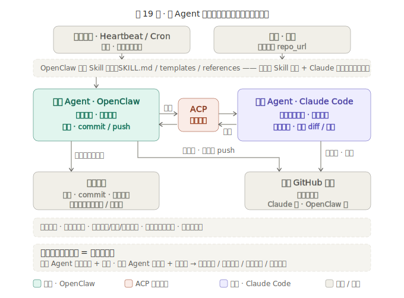

# GitHub Secret Auditor

> 配套课程：AI 业务流架构师 · 第 19 节《多 Agent 协作：夜间代码自愈实验室》

让 **OpenClaw 通过 ACP 调度 Claude Code**，对授权 GitHub 仓库完成一次**可验收、可提交、可汇报**的密钥泄露巡检与安全修复。

这个项目**不是一个独立运行的扫描脚本**，而是一份面向 OpenClaw 的 **Skill 协议**。它把"安全巡检"拆成两个 Agent 的协作流程：

- **OpenClaw（编排 Agent）** 负责任务编排、仓库准备、ACP 调度、结果验收、commit / push 和飞书汇报。
- **Claude Code（执行 Agent）** 负责进入授权代码仓库，完成敏感信息搜索、最小安全修复、本地检查和 diff 摘要输出。

最终用户不需要手动拼接命令，也不需要逐步操作 Claude Code。用户只给出目标仓库，OpenClaw 读取本 Skill 后完成后续闭环。



## 与课程的关系

本项目是第 19 节的最终项目之一。它展示的不是单点工具能力，而是一种可迁移的多 Agent 协作范式，服务于本节三个核心留存物：

| 留存物 | 在本项目中的体现 |
|---|---|
| **ACP 多 Agent 编排** | OpenClaw 经 ACP（后台 Sessions API / 飞书 `/acp` slash）调度 Claude Code——两个独立 Agent 协作完成一件工程任务，一个管任务流、一个管代码现场 |
| **夜间代码自愈自动化** | 同一套 Skill 可由 OpenClaw Heartbeat / Cron 在夜间无人值守触发：定时唤醒 → 自动巡检 → 最小修复 → 验收 → 推送报告 |
| **执行权与发布权分离** | Claude Code 只巡检 / 改文件 / 本地验证，**不 commit、不 push**；commit / push 只由 OpenClaw 验收通过后执行——无人值守下的安全护栏 |

> 与前三节（第 16/17/18 节"你驱动 Claude Code"）不同，本节的主角是 **OpenClaw 经 ACP 调度 Claude Code 在运行时自动协作**。本 Skill 不写任何扫描 / 修复代码、不调用大模型 API——智能在 Claude Code 的 agent 循环里。

> 第 18 节（[ai-quant-cli](../ai-quant-cli/)）造出一套可复用、可重跑的本地系统；第 19 节把它推进到**夜间自动化**——由 OpenClaw 唤醒、经 ACP 驱动 Claude Code 自动跑、推送报告。安全巡检只是本节选择的落地场景。

## 解决什么问题

很多 AI 工具可以指出代码片段里的风险，但真实团队需要的是一条完整交付链路：

- 能进入指定 GitHub 仓库，而不是只分析贴出来的片段。
- 能识别 API Key、Token、密码、Webhook URL、私钥片段、数据库连接串等泄露风险。
- 能按项目实际结构做最小修复，而不是机械创建固定模板文件。
- 能把修复结果留在 Git Diff 中，等待 OpenClaw 验收。
- 能由 OpenClaw 在验收通过后提交、推送，并通过飞书交付巡检报告。

本 Skill 的重点不是"让一个模型更会聊天"，而是把多 Agent 协作写成稳定的任务协议。

## Agent 分工

| 角色 | 主要职责 | 不做什么 |
| --- | --- | --- |
| OpenClaw | 读 Skill、准备仓库、生成任务包、调度 Claude Code、验收 diff、提交推送、发送报告 | 不跳过 Claude Code 手工替代巡检 |
| Claude Code | 在授权仓库内搜索敏感信息、修改真实代码、补充必要配置模板、输出验证结果 | 不 commit、不 push、不创建 PR、不输出完整密钥 |

## 安全边界

本 Skill 默认遵守以下边界：

- 只处理用户明确授权的 GitHub 仓库。
- 不读取 `.env`、真实环境配置、SSH Key、私钥、Cookie、生产配置和用户个人目录。
- 可以读取或更新 `.env.example`、示例配置和公开模板，但不得写入真实密钥。
- 不在仓库内生成或提交 `security-report.md`。
- 不强制创建 `.env.example` / README / `.gitignore` 三件套；只有修复确实需要时才补充。
- 不清理 Git 历史，不替用户轮换外部平台凭证。
- 疑似历史泄露写入风险备注（`risk_notes`），由用户或安全负责人继续处理。

## 前置条件

| 条件 | 说明 |
|---|---|
| OpenClaw 已部署，ACP / ACPX 后端健康 | `/acp doctor` 返回 `configuredBackend: acpx` / `registeredBackend: acpx` / `healthy: yes` |
| 服务器已装 Claude Code 并完成认证 | `claude -p "只回复 OK"` 返回 `OK`；OpenClaw 运行用户能访问同一个 `claude` 命令与配置 |
| 后台多轮投递已开启（如需补漏） | `tools.sessions.visibility=all` 且 `tools.agentToAgent.enabled=true` |
| GitHub 权限 | OpenClaw 运行用户具备目标仓库的 clone / commit / push 权限 |
| 仓库授权 | 目标仓库已获得用户明确授权 |

> 详细部署与排查见 [`references/preflight_setup.md`](references/preflight_setup.md)。API Key 只保存在服务器本地 `~/.claude/settings.json`，**不要写进仓库、飞书消息或截图**。

## 推荐入口

面向 OpenClaw 的最小用户入口（一句话全自动）：

```text
请使用 github-secret-auditor Skill 全自动巡检并修复 https://github.com/DjangoPeng/agentic-ai.git
```

换巡检仓库只需替换 GitHub 仓库地址。OpenClaw 先读取 [`SKILL.md`](skills/github-secret-auditor/SKILL.md)，再执行默认任务流；启动模板见 [`templates/run_skill_prompt.md`](templates/run_skill_prompt.md)，课堂实验步骤见 [`lesson19-lab.md`](lesson19-lab.md)。

## 交付结果

一次完整运行后，OpenClaw 应交付：

- 巡检状态：`passed` 或 `failed`
- 是否调用 Claude Code、调用方式（`acp`）
- 是否已推送到 GitHub、commit hash
- 修改文件清单、风险摘要、已完成修复、残余风险
- 历史泄露或外部凭证风险备注（`risk_notes`）
- 下一步建议

用户最终看到的是巡检后的结果，而不是后台调度细节。

## 目录结构

```text
github-secret-auditor/
├── README.md                 # 本文件：项目总览、协作架构、前置与入口
├── CLAUDE.md                 # 项目记忆：铁律、调用契约、验收标准、失败处理
├── lesson19-lab.md           # 第 19 节实验手册（部署 → ACP 握手 → 编排巡检，学生跟做）
├── skills/
│   └── github-secret-auditor/
│       └── SKILL.md          # Skill 主协议：触发场景、默认行为、分工、安全规则、验收
├── templates/
│   ├── run_skill_prompt.md           # 给 OpenClaw / 龙虾的一句话启动模板
│   ├── acp_steer_prompt.md           # OpenClaw 投递给 Claude Code 的巡检修复任务提示
│   └── openclaw_task.secret_audit.json   # 任务包模板：扫描范围 / 禁止文件 / 风险类型 / 修复策略 / 验收
├── references/
│   └── preflight_setup.md    # 前置部署参考（OpenClaw / Claude Code / ACP / 写入权限）
└── assets/                   # 实验手册配图（安装 / 配置 / 验证演示）
```

> 本项目**没有可运行代码、无需 `pip install`**——它是一份 Skill 协议，运行时由 OpenClaw + Claude Code 承担。巡检产物（克隆的仓库、任务包、报告）在服务器侧 `/srv/openclaw-runner/{repos,tasks,reports}`，不在本项目目录内。

## 上手：部署并跑通一次自愈巡检

本节不是"用 Claude Code 从空目录造系统"（那是第 18 节），而是**让 OpenClaw 经 ACP 调度 Claude Code**，跑通一次可验收、可推送、可汇报的自动化巡检。完整动手路径见 [`lesson19-lab.md`](lesson19-lab.md)：

1. 装好 Claude Code，确认 OpenClaw 能经 ACP 调用它（[`references/preflight_setup.md`](references/preflight_setup.md)）。
2. 安装本 Skill，`/acp doctor` 握手健康。
3. 准备授权仓库与任务包。
4. 只读试跑 → 补漏投递 → 最终安全巡检，由 OpenClaw 验收、commit / push、飞书汇报。

> 手动跑通后，这套 Skill 可交给 **OpenClaw Heartbeat / Cron 在夜间无人值守触发**（见第 6 节）——这就是"夜间代码自愈"：定时唤醒 → 自动巡检修复 → 验收 → 推送报告。课堂演示的是手动编排链路，留存物是这条链路能被定时自动化。

## 课程定位

同样的协作方式，可以从安全巡检迁移到代码质量巡检、依赖升级、配置治理、测试补全、数据资产巡检等更复杂的工程任务：

```text
业务 Agent 负责理解目标、组织流程、验收结果
执行 Agent 负责进入专业现场、完成具体动作、返回证据
```

## 相关课程章节

| 前置 | 内容 |
|---|---|
| 第 6 节 | OpenClaw Heartbeat / Cron 自动化（夜间唤醒的调度底座） |
| 第 9 节 | SKILL.md 编写（Skill 契约的写法） |
| 第 16 / 17 节 | Claude Code 基础与多文件协同重构 |
| 第 18 节 | 从空目录造一套可复用、可重跑的本地系统（[ai-quant-cli](../ai-quant-cli/)） |

> 本节（第 19 节）把第 18 节的可复用系统推进到多 Agent 协作的夜间自动化。
