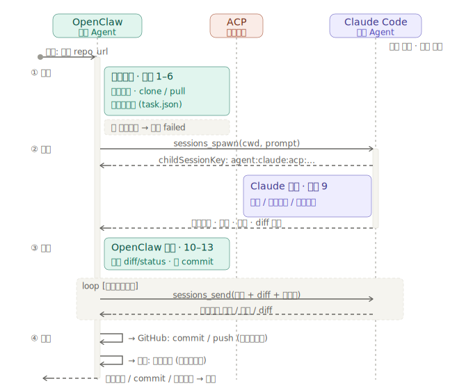
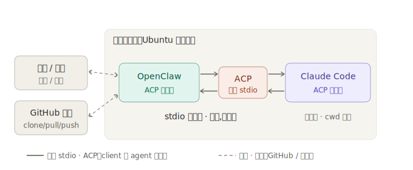
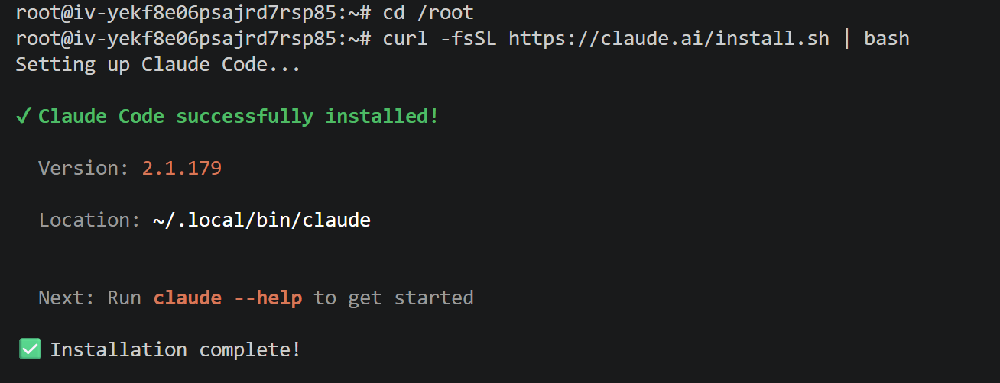
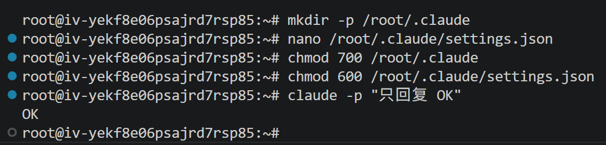

# 第 19 节 实验手册：OpenClaw 调度 Claude Code 完成 GitHub 安全巡检

> 配套课程：AI 业务流架构师 · 第 19 节《多 Agent 协作：夜间代码自愈实验室》
> 预计耗时：40–60 分钟
> 操作方式：步骤 0 在服务器命令行完成；从步骤 1 起把 Prompt 交给龙虾执行
> 前置条件：OpenClaw 已部署并接入飞书 / 对话框；有一台可 SSH 的服务器（步骤 0 在其上装 Claude Code 与 ACPX 后端）；部署细节见 references/preflight_setup.md

---

## 实验目标

1. 安装 Claude Code，并确认 OpenClaw 能调用它。
2. 安装 `github-secret-auditor` Skill。
3. 验证 OpenClaw 通过 ACP / ACPX 调度 Claude Code。
4. 完成一次只读试跑，确认 Claude Code 进入授权仓库。
5. 执行一次 GitHub 密钥泄露巡检，并由 OpenClaw 验收、提交、推送和飞书汇报。

---

## 核心链路

```text
用户给出仓库
-> OpenClaw 读取 Skill
-> 准备仓库和任务包
-> sessions_spawn 调度 Claude Code
-> Claude Code 巡检 / 修复 / 输出摘要
-> OpenClaw 验收 Git Diff
-> 必要时 sessions_send 补漏
-> OpenClaw commit / push / 飞书报告
```

> 这条链路的详细 16 步时序（含 `sessions_send` 补漏循环、验收闭环）见下图：



默认测试仓库：

```text
https://github.com/DjangoPeng/agentic-ai.git
```

默认路径：

```text
/root/projects/agentic-ai                                  # Skill 源：课程仓库 main 分支，Skill 在 github-secret-auditor/ 子目录
/srv/openclaw-runner/repos/agentic-ai                      # 巡检目标：同一仓库的 secret-audit-demo 分支
/srv/openclaw-runner/tasks/agentic-ai-secret-audit.json
/srv/openclaw-runner/reports/agentic-ai-security-report.md
```

> 注意：`DjangoPeng/agentic-ai` 在本实验里身兼两职——既是 **Skill 源**（`main` 分支，OpenClaw 从中读取 `github-secret-auditor/` 下的 Skill），又是 **巡检目标**（`secret-audit-demo` 分支，Claude Code 在其上扫描修复）。因此它被 clone 两份、落在两个不同路径、检出两条不同分支，互不干扰。

安全边界：

- 只操作授权仓库。
- 不读取真实 `.env`、私钥、Cookie、生产配置和用户个人目录。
- Claude Code 不 push；push 只由 OpenClaw 验收后执行。
- 报告只发飞书或写入 `/srv/openclaw-runner/reports`，不要提交进仓库。

---

## 0. 服务器端准备：Claude Code 与 ACPX 后端

这一拍的目标不是开始巡检，而是先在服务器上把两样东西装好：**执行者** Claude Code，和 OpenClaw 调度它要走的 **ACPX 后端**。两者都在服务器命令行完成（0.1 装 Claude Code，0.2 装 ACPX），不要发给龙虾。



> ACP 的标准传输是 **stdio 子进程**：OpenClaw 在本机把 `claude` 当子进程拉起来通信。所以 **Claude Code 必须和 OpenClaw 装在同一台主机**，且 gateway 服务账户要能调用同一个 `claude`——这正是本实验把 Claude Code 装到 OpenClaw 服务器上的原因。

### 0.1 安装并接入 Claude Code

官方文档：

```text
https://docs.anthropic.com/en/docs/claude-code/getting-started
https://code.claude.com/docs/en/installation
```

课堂服务器推荐使用安装脚本：

```bash
cd /root
curl -fsSL https://claude.ai/install.sh | bash
```

安装成功后参考这张图确认：



这一步不要发给龙虾执行。请在服务器 SSH / Terminal 里自己完成，尤其是 `settings.json` 里的 API Key，不要通过飞书、聊天窗口或截图暴露。

装好后 `~/.claude` 目录已经有了。先建一个空的 `settings.json` 并**立刻 `chmod 600`**——这样待会儿写进去的真实 Key 从一开始就只有本人能读，没有"短暂可被他人读取"的窗口：

```bash
mkdir -p /root/.claude                  # 已存在则无副作用（install 通常已建好）
touch /root/.claude/settings.json       # 先把空文件建出来
chmod 600 /root/.claude/settings.json   # 写入真实 Key 之前就收紧权限
```

如果使用 Claude 官方登录，按交互式登录完成认证即可。

本课程推荐用**火山引擎方舟 Coding Plan**（购买套餐与获取 API Key 见 [`openclaw-models/volcengine-coding-plan.md`](../openclaw-models/volcengine-coding-plan.md)）。

> ⚠️ **协议别搞混**：火山 Coding Plan 有两个不同的接入地址，对应两种协议——
> - **OpenClaw**（OpenAI 协议）用 `https://ark.cn-beijing.volces.com/api/coding/v3`（带 `/v3`），配在 `~/.openclaw/openclaw.json`。
> - **Claude Code**（Anthropic 协议）用 `https://ark.cn-beijing.volces.com/api/coding`（**不带 `/v3`**），配在 `~/.claude/settings.json`，Claude Code 会自动在其后拼 `/v1/messages`。
>
> 把 OpenClaw 那个 `/api/coding/v3` 填进 Claude Code，会因协议不符打不通。

在 `~/.claude/settings.json` 写入下面的结构（`ANTHROPIC_AUTH_TOKEN` 只填你自己的真实 Key，课件、仓库、飞书消息和截图里都不要出现完整密钥）：

```json
{
  "env": {
    "ANTHROPIC_BASE_URL": "https://ark.cn-beijing.volces.com/api/coding",
    "ANTHROPIC_AUTH_TOKEN": "<你的火山 API Key，只存服务器本地>",
    "ANTHROPIC_MODEL": "ark-code-latest",
    "CLAUDE_CODE_DISABLE_NONESSENTIAL_TRAFFIC": "1"
  }
}
```

配置要点：

- `ANTHROPIC_BASE_URL`：火山 Coding Plan 的 **Anthropic 兼容地址** `https://ark.cn-beijing.volces.com/api/coding`（**不带 `/v3`**；带 `/v3` 的是 OpenClaw 用的 OpenAI 地址）。用 Claude 官方交互式登录则不填这一项。
- `ANTHROPIC_AUTH_TOKEN`：火山 API Key（方舟控制台获取），只能保存在服务器本地配置中，不要写进课件、仓库、飞书消息或截图。
- `ANTHROPIC_MODEL`：火山模型名，如 `ark-code-latest`（方舟自动调度最优编程模型）或 `kimi-k2.5`。用非 Claude 模型时**必填**，否则 Claude Code 默认请求 `claude-opus-4-8`，火山不认。
- `CLAUDE_CODE_DISABLE_NONESSENTIAL_TRAFFIC`：减少非必要网络流量，课堂服务器建议开启。
- `/root/.claude/settings.json` 必须设置为 `600`，避免其他用户读取。

把上面的 JSON 写进这个已收紧权限的文件（含你的真实 Key），然后验证：

```bash
nano /root/.claude/settings.json    # 粘入上面那段 JSON（含真实 Key），保存退出；600 权限会保留
claude -p "只回复 OK"                # 期望返回 OK
```

如果 OpenClaw gateway 不是 root 用户启动的，还要确认 gateway 运行用户也能访问同一个 `claude` 命令和对应配置。否则终端里能跑通，OpenClaw 仍然可能调度失败。

通过标准：

- `command -v claude` 有明确路径。
- `/root/.claude/settings.json` 存在，且没有暴露完整密钥。
- `claude -p "只回复 OK"` 返回 `OK`。
- OpenClaw 运行用户能访问同一个 `claude` 命令。

验证通过后参考这张图确认：



### 0.2 安装并启用 ACPX 后端

OpenClaw 通过 **ACPX 后端**经 ACP 调度 Claude Code。ACPX 随 OpenClaw 一起分发（打包在 `dist/extensions/acpx`），但要显式安装启用——没装时步骤 2 的 `/acp doctor` 会报 backend 不健康，`sessions_spawn` 也找不到 acp runtime。这一步同样在服务器命令行完成，不发给龙虾。

先看当前插件里有没有 `acpx`：

```bash
openclaw config get plugins
```

`entries` 里没有 `acpx` 就装上。它从 OpenClaw 自带扩展解析，不需要联网下载：

```bash
openclaw plugins install acpx
```

再确认一次：`acpx` 应已进入 `allow`，且 `entries.acpx.enabled` 为 `true`：

```bash
openclaw config get plugins
```

期望片段（`config` 里的写入权限策略稍后在「关键配置」一节按需调整）：

```json
"acpx": {
  "enabled": true,
  "config": {
    "permissionMode": "approve-all",
    "nonInteractivePermissions": "fail",
    "timeoutSeconds": 120
  }
}
```

重启 gateway 让插件生效：

```bash
systemctl restart openclaw
```

> 顺带清理：若 `openclaw config get plugins` 顶部出现 `plugins.allow: plugin not found: help (stale config entry ignored...)` 一类告警，是 `allow` 列表里残留了已不存在的插件名。重设 `allow` 去掉它即可，重启后告警消失——无害，纯清理：
>
> ```bash
> openclaw config set plugins.allow '["acpx","memory-core","openclaw-lark","openclaw-weixin","volcengine"]'
> ```

通过标准：

- `openclaw config get plugins` 中 `acpx` 在 `allow` 列表，且 `entries.acpx.enabled: true`。
- gateway 重启无报错。
- 步骤 2 的 `/acp doctor` 返回 `configuredBackend: acpx` / `registeredBackend: acpx` / `healthy: yes`。

---

## 1. 安装 github-secret-auditor Skill

这一步让 OpenClaw 把 Skill 从 **GitHub 远端**克隆 / 拉取到**服务器本地**（`/root/projects/agentic-ai`）。源始终是 GitHub —— `git clone` 首次全量下载、`git pull` 之后增量更新最新 `main`；本地目录只是**检出落地点,不是代码来源**。因为 ACP 要求 OpenClaw 与 Claude Code 同机,Skill 必须先躺在服务器本地文件系统上 OpenClaw 才读得到,所以是「先从 GitHub 拉到本地,再本地读取」。

发给龙虾：

```text
请帮我安装并更新第 19 节实验用的 github-secret-auditor Skill。

目录：
- Skill 源（课程仓库）：/root/projects/agentic-ai（Skill 在子目录 github-secret-auditor/）
- 仓库：/srv/openclaw-runner/repos
- 任务包：/srv/openclaw-runner/tasks
- 报告：/srv/openclaw-runner/reports

请执行：
1. 创建目录：
   mkdir -p /root/projects /srv/openclaw-runner/repos /srv/openclaw-runner/tasks /srv/openclaw-runner/reports

2. 如果课程仓库已存在：
   cd /root/projects/agentic-ai && git checkout main && git pull --ff-only

3. 如果课程仓库不存在：
   cd /root/projects && git clone git@github.com:DjangoPeng/agentic-ai.git

4. 记录版本：
   cd /root/projects/agentic-ai && git rev-parse --short HEAD

5. 检查文件（均在 github-secret-auditor/ 子目录下）：
   - github-secret-auditor/skills/github-secret-auditor/SKILL.md
   - github-secret-auditor/templates/run_skill_prompt.md
   - github-secret-auditor/templates/acp_steer_prompt.md
   - github-secret-auditor/templates/openclaw_task.secret_audit.json
   - github-secret-auditor/references/preflight_setup.md

暂时不要执行巡检、不要修改目标仓库、不要 push。

回报：
- Skill 安装状态：passed / failed
- Skill 路径
- 当前 commit
- 关键文件是否齐全
- 如失败，贴核心报错
```

通过标准：

- 课程仓库在 `/root/projects/agentic-ai`，Skill 在 `github-secret-auditor/` 子目录。
- 关键文件齐全。
- 能记录当前 git commit，方便排查版本差异。

---

## 2. 验证 ACP 握手

注意：`/acp ...` 是飞书 / OpenClaw 对话框命令，不是 shell 命令。

在飞书 / OpenClaw 对话框发送：

```text
/acp doctor
```

期望：

```text
configuredBackend: acpx
registeredBackend: acpx
healthy: yes
```

到这里先不创建 Claude Code 会话。

原因：`/acp spawn` 或 `sessions_spawn` 都需要指定 `cwd`，也就是目标仓库路径。目标仓库要到步骤 3 才准备好。

本实验只确认一件事：OpenClaw 的 ACPX 后端是健康的，后面可以调度 Claude Code。

---

## 关键配置

### 允许课堂演示环境写入授权仓库

如果 Claude Code 只能分析、不能修改授权仓库，可临时设置：

```bash
openclaw config set plugins.entries.acpx.config.permissionMode approve-all
openclaw config set plugins.entries.acpx.config.nonInteractivePermissions fail
```

设置后必须：

1. 重启 OpenClaw gateway。
2. 重新执行 `/acp doctor`。
3. 重新创建 Claude ACP 会话。

旧 session 可能沿用旧权限。

实验结束后建议恢复：

```bash
openclaw config set plugins.entries.acpx.config.permissionMode approve-reads
openclaw config set plugins.entries.acpx.config.nonInteractivePermissions deny
```

### 开启后台补漏投递

如果要使用 `sessions_send` 补漏，确认：

```bash
openclaw config set tools.sessions.visibility all
openclaw config set tools.agentToAgent.enabled true
```

典型错误：

```text
Session send visibility is restricted
Agent-to-agent messaging is disabled
```

看到这些错误：设置配置、重启 gateway、重新创建 session。

---

## 3. 准备仓库和任务包

> 审计目标用课程项目 `DjangoPeng/agentic-ai` 的**一次性测试分支 `secret-audit-demo`**：巡检 / 修复 / 推送都落在该分支，`main` 永不被碰；植入的假密钥隔离在 `demo_target/`，与仓库里既有脱敏示例区分。该分支需已存在于远端（OpenClaw 从远端 clone）。

发给龙虾：

```text
请准备第 19 节安全巡检实验的测试仓库和任务包。

目标仓库：
https://github.com/DjangoPeng/agentic-ai.git

本地路径：
/srv/openclaw-runner/repos/agentic-ai

任务包路径：
/srv/openclaw-runner/tasks/agentic-ai-secret-audit.json

报告路径：
/srv/openclaw-runner/reports/agentic-ai-security-report.md

请执行：
1. 如果本地仓库不存在，clone 到 /srv/openclaw-runner/repos/agentic-ai 并切到 secret-audit-demo 分支。
2. 如果本地仓库已存在，先执行 git status --short。
3. 如果工作区不干净，停止并回报 failed，不要 reset，不要覆盖。
4. 如果工作区干净，执行 git pull --ff-only。
5. 基于 Skill 模板生成任务包到 /srv/openclaw-runner/tasks/agentic-ai-secret-audit.json。

任务包至少包含：
- repo_url: https://github.com/DjangoPeng/agentic-ai.git
- repo_path: /srv/openclaw-runner/repos/agentic-ai
- branch: secret-audit-demo
- allow_auto_fix: true
- allow_push: true
- report_path: /srv/openclaw-runner/reports/agentic-ai-security-report.md

安全规则：
- 不读取真实 .env、私钥、Cookie、生产配置和用户个人目录。
- 不输出完整密钥。
- 不提交 security-report.md。
- Claude Code 不 push，push 由 OpenClaw 验收后执行。

回报：
- 仓库当前 commit
- git status --short
- 任务包路径
- repo_url / repo_path / report_path
- 是否有阻塞问题
```

换仓库时至少同步修改：

```text
repo_url
repo_path
task_file
report_path
仓库目录名
```

---

## 4. 创建并记录 ACP 会话（只读试跑）

这一步才真正创建 Claude Code ACP 会话，并记录后续补漏投递要用的 `childSessionKey`。

先做只读试跑，不允许修改文件。

发给龙虾：

```text
请通过 OpenClaw Sessions API 调度 Claude Code 做只读试跑。

调用要求：
- runtime="acp"
- agentId="claude"
- mode="run"
- thread=false
- cwd="/srv/openclaw-runner/repos/agentic-ai"
- prompt="请输出 pwd 和 git status --short，不要修改文件。"

等价形态：
sessions_spawn(
  runtime="acp",
  agentId="claude",
  mode="run",
  thread=false,
  cwd="/srv/openclaw-runner/repos/agentic-ai",
  prompt="请输出 pwd 和 git status --short，不要修改文件。"
)

回报：
- status
- childSessionKey，必须是完整的 agent:claude:acp:...
- pwd
- git status --short
- 是否有文件被修改
- 如失败，贴核心报错
```

说明：

- 后台自动化里，这个记录叫 `childSessionKey`。
- 飞书 slash command 演示里，这个记录叫 `session-key`。
- 两者本质上都是同一个东西：Claude Code ACP 会话地址，格式是 `agent:claude:acp:<uuid>`。
- 后续 `sessions_send` 补漏时，必须使用完整值，不要只复制 UUID。

通过标准：

```text
childSessionKey: agent:claude:acp:...
pwd: /srv/openclaw-runner/repos/agentic-ai
git status --short: 空
```

如果 `pwd` 不对或工作区不干净，不进入最终巡检。

---

## 5. 验证补漏投递

发给龙虾：

```text
请使用上一轮返回的 childSessionKey 做 sessions_send 只读测试。

要求：
- sessionKey 使用完整 agent:claude:acp:...
- 不修改文件
- 不 push

等价形态：
sessions_send(
  sessionKey="<childSessionKey>",
  prompt="只读测试：请再次输出 pwd 和 git status --short，不要修改文件。"
)

回报：
- sessions_send 是否成功
- pwd
- git status --short
- 是否有文件被修改
- 如失败，贴核心报错
```

注意：`childSessionKey` 是投递目标，不是记忆保证。真正补漏时，prompt 必须带上：

- 上一轮输出
- 当前 Git Diff
- 验收缺失项
- 本轮允许修改范围

不要只写“继续修一下”。

---

## 6. 执行最终安全巡检

只读试跑和补漏投递通过后，执行最终实验。

发给龙虾：

```text
请使用 /root/projects/agentic-ai/github-secret-auditor/skills/github-secret-auditor/SKILL.md 执行一次全自动 GitHub 密钥泄露巡检。

目标仓库：
https://github.com/DjangoPeng/agentic-ai.git

要求：
1. 全程自动化执行，不要让我手动复制 session、手动执行命令、手动拼接 prompt 或手动验收。
2. OpenClaw 自动读取 Skill、准备仓库、生成任务包、通过 ACP Sessions API 调度 Claude Code、验收修复、commit、push，并通过飞书汇报。
3. Claude Code 负责仓库内敏感信息巡检和代码修复；OpenClaw 不要手工替代 Claude Code 修复。
4. 安全巡检先判断仓库是否存在泄露，再按仓库实际结构做最小安全修复。
5. 不要把修复固定成 .env.example / README / .gitignore 三件套。
6. 最终只回复巡检结果、是否修复、是否推送、commit、风险摘要、风险备注和下一步建议。

最终回复格式：

状态：passed / failed
目标仓库：DjangoPeng/agentic-ai
是否调用 Claude Code：yes / no
调用方式：acp / failed
是否已推送到 GitHub：yes / no
commit：<commit hash>
修改文件：
- ...
风险摘要：
- ...
已完成修复：
- ...
残余风险：
- ...
风险备注：
- ...
下一步建议：
- ...
```

---

## 结果判断

### 通过并修复

应看到：

- `状态：passed`
- `是否调用 Claude Code：yes`
- `调用方式：acp`
- 有 commit hash
- 飞书报告包含风险摘要、修改文件、push 状态和下一步建议

同时检查：

- GitHub 上有普通修复 commit。
- commit 中没有 `security-report.md`。
- diff 只包含授权仓库内修复。
- 报告不输出完整密钥。

### 未发现泄露

也可能是成功结果。重点看：

- 说明巡检通过。
- 不强行改文件。
- 不强行 commit。
- 有报告或结果摘要。

### failed

必须返回明确原因，例如：

- ACP runtime 不可用
- GitHub 权限不足
- 工作区不干净
- Claude Code 无法写文件
- `sessions_send` visibility / agent-to-agent 权限不足

---

## 验收标准

完成实验时，应满足：

- Claude Code 安装并验证通过。
- 课程仓库克隆到 `/root/projects/agentic-ai`，Skill 在 `github-secret-auditor/` 子目录。
- `/acp doctor` 返回 healthy。
- 只读试跑返回正确 `pwd` 和空的 `git status --short`。
- 最终巡检通过 ACP Sessions API 调度 Claude Code。
- Claude Code 只在授权仓库内工作。
- 不读取真实 `.env`、私钥、Cookie、生产配置和用户个人目录。
- Claude Code 不 push；OpenClaw 验收后才 commit / push。
- 飞书报告或 `/srv/openclaw-runner/reports` 有巡检结果。
- 报告未提交进 GitHub 仓库。

---

## 常见问题速查

- `claude: command not found`：检查 `~/.local/bin/claude` 是否存在，并确认 `~/.local/bin` 在 PATH 中。
- 当前终端能运行 `claude`，OpenClaw 不能：多半是 gateway 运行用户或 PATH 不一致。
- `claude -p "只回复 OK"` 失败：检查认证、API Key 或中转配置。
- `/acp doctor` 失败或 backend 不健康：先 `openclaw config get plugins` 确认 `acpx` 已安装且 `enabled: true`（没有就 `openclaw plugins install acpx`，见步骤 0.2），再重启 gateway。
- `/acp` 在 shell 中失败：正常，`/acp` 只能在飞书 / OpenClaw 对话框执行。
- `/acp spawn` 失败：检查 `--cwd` 是否存在且为授权仓库。
- Claude Code 只能分析不能写：检查 ACPX 写入权限和文件系统权限。
- 改了 `approve-all` 仍不能写：重启 gateway，重新创建 session。
- `sessions_send` forbidden：检查 `tools.sessions.visibility=all` 和 `tools.agentToAgent.enabled=true`。
- 补漏像忘了上一轮：`sessions_send` prompt 必须显式带上上一轮输出、当前 diff 和缺失项。
- Skill 仍问“是否确认修改”：说明没有读到 Skill 或默认自动化行为未生效。
- 报告被提交进仓库：错误，应从 commit 中移除报告文件。
- 输出完整密钥：安全事故，应撤回输出，只保留脱敏片段。

---

## 实验记录

| # | 发生在哪一步 | 预期行为 | 实际行为 | 你的解决方法 |
|---|------------|----------|---------|------------|
| 1 | | | | |
| 2 | | | | |
| 3 | | | | |

---

## 课后作业

### 必做 1：复现只读链路

通过 OpenClaw 调度 Claude Code，输出 `pwd` 和 `git status --short`，确认 Claude Code 进入授权仓库且没有修改文件。

交付：

- OpenClaw 对话截图
- `childSessionKey`
- `git status --short` 为空的截图

### 必做 2：跑一次安全巡检 dry-run

准备测试仓库，放入一个明显假密钥：

```text
DEMO_API_KEY=REPLACE_WITH_FAKE_DEMO_VALUE
```

通过 OpenClaw + Claude Code 完成只读巡检或 dry-run 分析，要求识别风险、给出修复建议和预期 diff，但不要 push。

交付：

- 测试仓库链接
- OpenClaw 对话记录
- 风险摘要
- dry-run 修复建议截图

### 选做 3：迁移到轻量代码质量检查

设计一个只读任务，例如：

- 检查 README 是否缺少启动说明
- 检查项目是否缺少 LICENSE
- 检查 `package.json` 是否缺少 test script

交付：

- 任务包 Markdown 或 JSON
- OpenClaw 执行截图
- 检查结果摘要
- 100-200 字复盘
